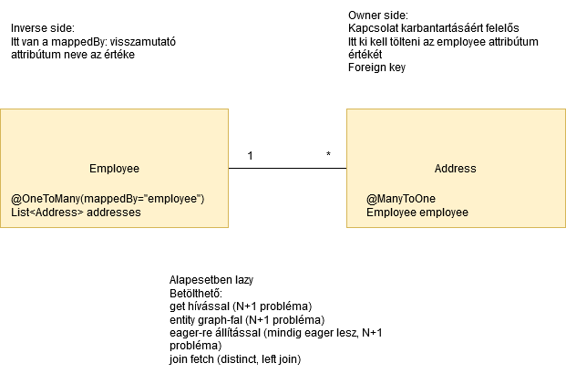
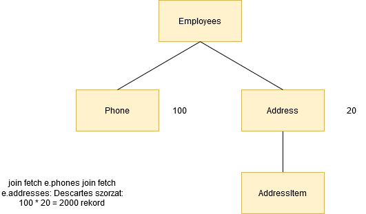
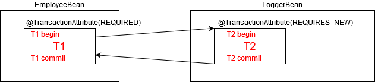
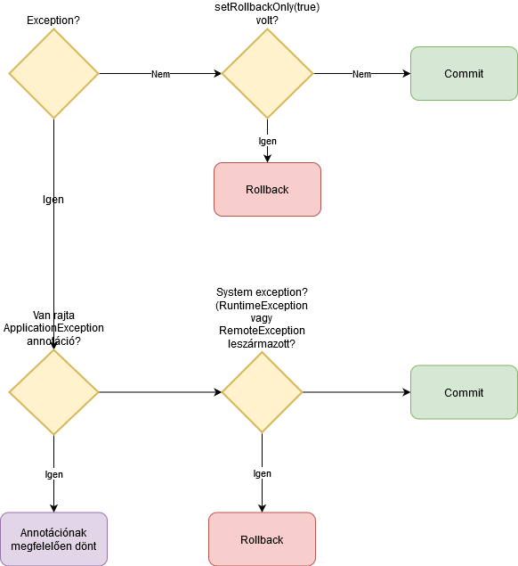

# Adatbáziskezelés JDBC és JPA technológiákkal

## Ajánlott irodalom

* Pro JPA 2
* https://vladmihalcea.com/blog/
* https://blog.jooq.org/

## Átismétlendő

* JDBC API, JDBC Driver, milyen interfészek vannak benne? (`Connection`, `Statement`, stb.)
* `DataSource` (factory method, csak a konfigurációkat tartalmazza), connection pool
* JPA implementációk: EclipseLink, Hibernate (említett különbségek: lazy kezelés)
* Mitől lesz egy osztályból entitás? (`@Entity` annotáció, id típusú mező)
* Milyen típusú mezői vannak? (perzisztens és kapcsolatot reprezentáló)
* Mire való az `EntityManager`, és milyen műveletei vannak (CRUD)?
* Mi a persistence unit (statikus konfiguráció, `persistence.xml` és entitások) és persistence context fogalma (memóriában lévő managed entitások halmaza)?
* Ha több adatbázishoz akarunk kapcsolódni, akkor több persistence unit kell, egy entitást csak egy persistence contextbe lehet menteni
* Meddig tart a persistence context? Tipikusan tranzakciónyi, webes alkalmazásnál requesthez köthető) v. extended
* Managed és detached fogalma
* Hogyan történik egy entitás módosítása? (Csak be kell tölteni, majd set művelet, nem kell további metódust hívni)
* Ha módosítunk egy entitást, majd lekérdezést végzünk rá, a persistence provider biztosítja, hogy helyes legyen a lekérdezés eredménye, szóval lehet, hogy a módosítást flush-öli adatbázisba
* Ha azonban natív query-t írunk, akkor nem feltétlenül lesz a módosított entitás az adatbázisba, ekkor kézzel kell `flush()` metódust hívni
* Bulk műveletek https://www.jtechlog.hu/2009/05/07/jpa-tomeges-muveletek.html
* Query visszatérési típusai: (entitás, list, dto, array, stream)
    * Projection query
    * `List` esetén mindent lepéldányosít
    * Streammel gyorsabb feldolgozást lehet elérni, kevesebb memóriahasználattal
* Named query: telepítéskor syntax check, valamint cache-eli a szintaxis fát, nem parse-olja mindig újra és újra, újabb JPA-ban már dinamikusan is lehet kódból named query-ket felvenni
* Kapcsolódó entitások:
    * Mire való az `@ElementCollection`?    
    * Van számosságuk és irányuk
    * Hogyan kell összekötni a két irányt? Az owner side/inverse side mit jelent?
    * Mit jelent a lazy betöltés? https://www.jtechlog.hu/2012/04/22/jpa-lazy-loading.html
    * Mikor jelentkezik a `LazyInitializationException`?
    * Lazy-eager default értékek
    * Hogyan lehet a lazy-vel kapcsolódó entitásokat betölteni?
    * Mire való az entity graph? https://www.jtechlog.hu/2015/06/09/jpa-entity-graph.html
    * N + 1 probléma
    * Eagerre állítás nem ajánlott. Betölthető `get` hívással`. Lehet a lekérdezésben `join fetch`.
    * Mire való a `getReference`?
    * Mi történik, ha két kapcsolódó entitás van és mind a kettőt join fetch-csel töltünk be? https://www.jtechlog.hu/2013/03/17/jpa-tobb-one-to-many-kapcsolat.html





* Tranzakciókezelés (tranzakció határok, propagáció, `REQUIRES`, `REQUIRES_NEW`), ajánlott olvasmány: https://www.jtechlog.hu/2010/05/31/tranzakciokezeles.html






Javasolt library-k:

* SQL-re: MyBatis https://mybatis.org/mybatis-3/
* JOOQ (fizetős) https://www.jooq.org/
* Java EE kiegészítés: Apache DeltaSpike (portable CDI extensions)
    * Core és Modules https://deltaspike.apache.org/documentation/modules.html
    * Java SE-ben Java EE feature-ök
    * `@Transactional` CDI bean metódusokon, transactional context
    * JPA kiegészítés - repository pattern : Data https://deltaspike.apache.org/documentation/data.html    
    * Auditing támogatás    

## Architektúrális megfontolások

Az ORM mellett JDBC használata megengedett, pl. nagy mennyiségű adatok esetén.
Átmenet a kettő között a projection query, `SqlResultSetMapping`, `ConstructorResult` és a native query.

Adatbázis alapú integráció rendszerek között idejétmúlt megoldás. Adatbázis sémának az alkalmazás
belügyének kell lennie. Ha más rendszer is kapcsolódik hozzá, akkor problémás a séma
refaktorálás, továbbfejlesztés, verziókiadás. Kompromisszumként elképzelhetők
kommunikációs táblák, view-k, melyek "API-ként" viselkednek.

Ezet a fajta integrációt meghaladta a EAI, SOA és microservices is. Egyéb választható
integrációs megoldások:

* SOAP és REST webszolgáltatások
* Üzenet sorok
* Kafka
* gRPC (Protobuf vs. Avro)
* GraphQL

## Példák

Address más Employee-hoz kapcsolódjon:

```java
public void connectAddressToEmployee(long addressId, long employeeId) {
  Address address = em.find(Address.class, addressId);
  Employee employee = em.getReference(Employee.class, employeeId); // Nem töltjük be az entitást
  address.setEmployee(employee);
}
```

## Házi feladat

* Hogyan lehet biztosítani, hogy a `@OneToMany`-vel kapcsolódó entitások sorrendben
kerüljenek betöltésre?
* Mire való az Attribute Converter?

A gyakorlati házi feladat lehetőséget ad a legfrissebb technológiák kipróbálására, de a
régebbi/eltérő környezetekben is megoldható.

Adatbázis: PostgreSQL, legkönnyebben Dockerrel indítható (persze feltelepített is használható)

```
docker run --name bank-postgres -e POSTGRES_PASSWORD=mysecretpassword -d -p 5432:5432 postgres
```

Alkalmazásszerver: WildFly 19.0.0, letölthető a https://wildfly.org/downloads/ címről.
Ki kell csomagolni, majd a `bin/standalone.bat` paranccsal indítható. Ennek telepítését
nem ajánlom Dockerben, mert lokálisan telepítve akár IDE-ből könnyebben vezérelhető.
Java 13 szükséges.

Ez után fel kell venni a DataSource-ot, amin keresztül a PostgreSQL-hez kapcsolódhat.
Ehhez előbb kell a JDBC Driver: https://jdbc.postgresql.org/download/postgresql-42.2.12.jar

A `bin/jboss-cli.bat` állományt elindítva a parancssorba beírandó:

```
connect
deploy "postgresql-42.2.12.jar"
data-source add --name=BankDS --jndi-name=java:/jdbc/BankDS \
  --driver-name=postgresql-42.2.12.jar \
  --connection-url=jdbc:postgresql:postgres \
  --user-name=postgres \
  --password=mysecretpassword
```

A jar fájl megadásánál megadható a teljes elérési útja.

Elemezd a `bank` könyvtárban lévő alkalmazást! Próbáld telepíteni a WildFly-ra az `mvn clean package wildfly:deploy`
parancs használatával!

Az IDEA `.http` fájljának használatával vagy Postmannel próbáld meghívni a REST végpontokat!

Hozz létre egy új `Account` entitást azonosítóval és egy `balance` mezővel!
Hozz létre hozzá egy SQL fájlt, ami létrehozza a táblát, és beszúr két rekordot (pl. 1000 és 2000 egyenleggel)!
Hozz létre hozzá repository-t!
Hozz létre egy `AccountBean` session beant, melynek `listAccounts()` metódusa listázza az összes számlát!
Hozz létre egy `credit(long accountId, long amount)` metódust, ami a paraméterként megadott
számlára rátesz paraméterként megadott összeget! Negatív érték esetén levon.
Hozz létre egy `AccountResource` osztályt, melynek `listAccounts()` metódusa
listázza a számlákat.

Amennyiben a számlán lévő összeg negatív lenne, dobjon egy `IllegalCreditException` saját
checked exception-t!

A `TransferBean` `createTransfer(CreateTransferCommand command)` metódusából a
`TODO` részen, a `Transfer` entitás mentése után hívd meg az előbb létrehozott
`credit()` metódust a forrás számlával és negatív összeggel, majd a cél számlával
pozitív összeggel! A kivételt itt kezeld!

Figyeld meg, hogy nincs rollback! Mit tudsz tenni, hogy rollback legyen?

Gondolkodj el rajta, hogy implementálnád azt, hogy miután ellenőrzöd az összeget,
majd le is vonod, közben egy másik tranzakció ne tudja módosítani a számla egyenleget!

A megoldásod töltsd fel GitHubra!
